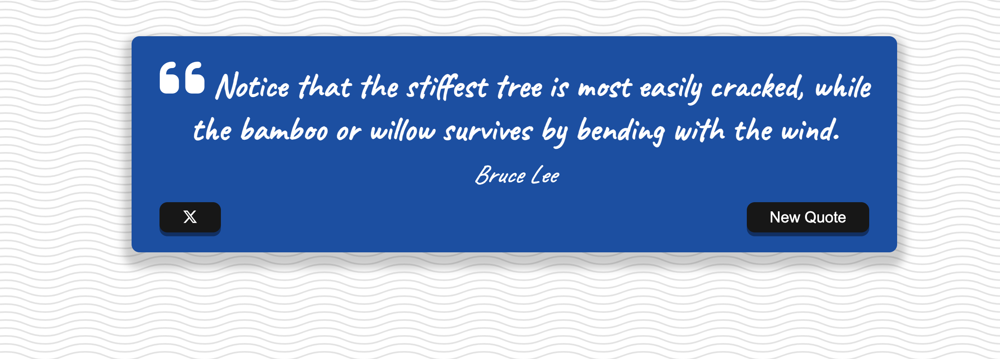

# Quote Generator Project

<!-- 
 -->

Welcome to the Quote Generator project! This project is a part of my portfolio, showcasing my skills in working with asynchronous functions, fetching data from APIs, and enhancing user experience through interactive features. The Quote Generator allows users to explore inspirational quotes, share them on Twitter, and generate new quotes with the click of a button.

## Features

- Display random quotes along with the name of the author.
- Share your favorite quotes directly to Twitter.
- Fetch new quotes from the 'QUOTABLE' API to keep the inspiration flowing.
- Engaging user experience with a loading spinner providing feedback during data retrieval.

## Getting Started

1. Clone the repository: `git clone https://github.com/rafaelstoner/quote-generator.git`
2. Navigate to the project directory: `cd quote-generator`
3. Open the `index.html` file in your preferred web browser.

## Contributing

I welcome contributions from the community to make this project even better! Here are a few suggestions for potential contributions:

- **Add Sharing to Other Social Platforms**: Extend the sharing functionality to include other social media platforms, such as Facebook or Instagram.
- **Favorite Quotes**: Implement a feature that allows users to save their favorite quotes for future reference.
- **UI Enhancements**: Make the user interface even more visually appealing and user-friendly.
- **Localization**: Add support for multiple languages to make the app accessible to a wider audience.

If you're interested in contributing, feel free to open a pull request with your changes. Please ensure your code follows the project's coding standards and is well-documented.

## License

This project is licensed under the [MIT License](LICENSE.txt).

---

Let's connect! If you have any questions, ideas, or just want to chat, you can reach me at [rafaelstoner7@gmail.com](mailto:rafaelstoner7@gmail.com). You can also find more of my work on [GitHub](https://github.com/rafaelstoner) and [LinkedIn](https://www.linkedin.com/in/rafaelstoner/).

Enjoy exploring quotes and have fun contributing to the project! 🚀
